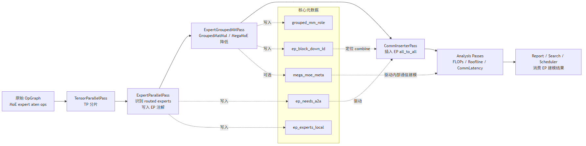
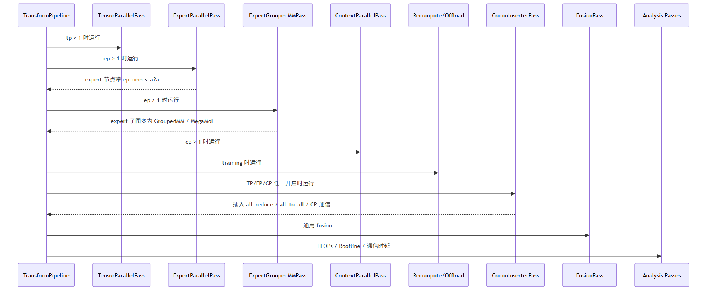
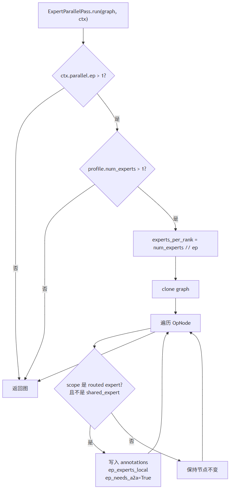
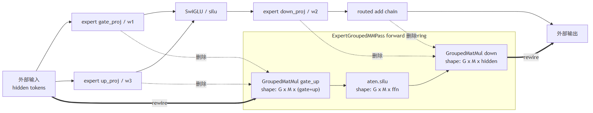
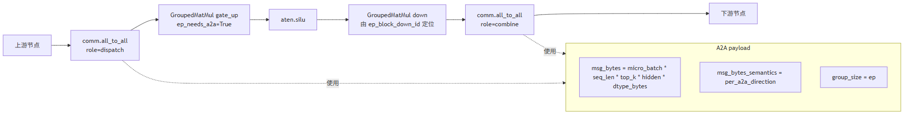
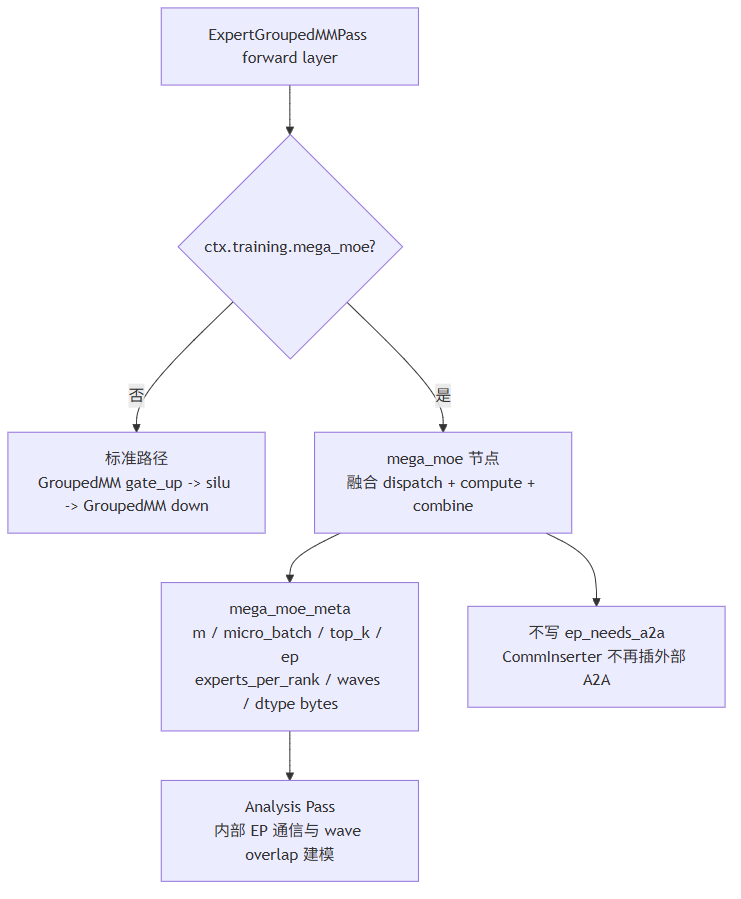
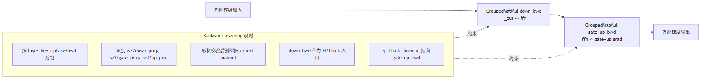
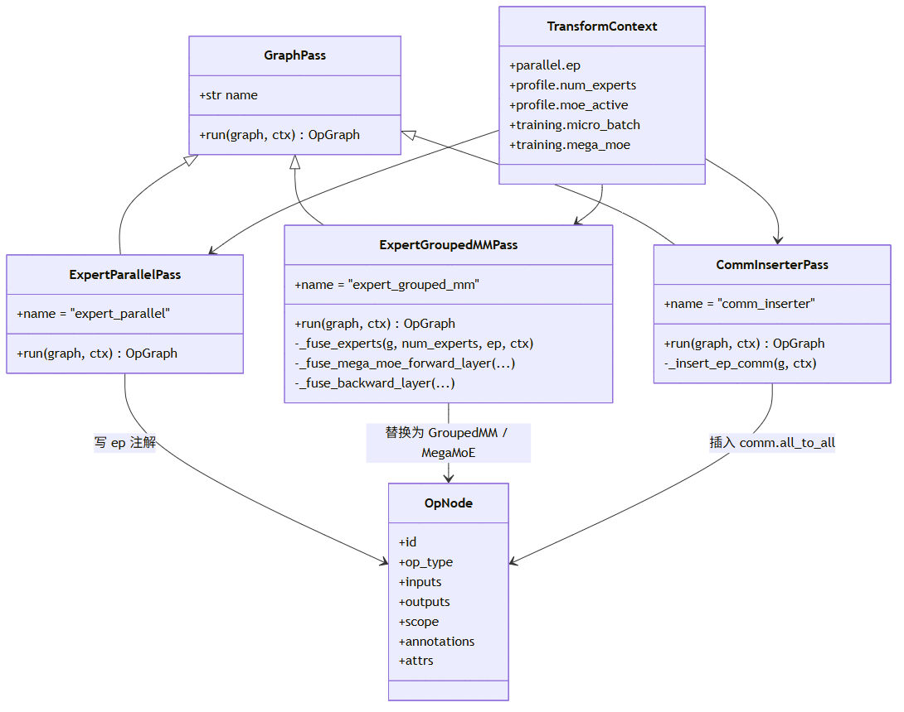

# Expert Parallel 与 GroupedMM 设计文档

本文档基于当前代码中的 `python/zrt/transform/parallel/expert_parallel.py` 与 `python/zrt/transform/parallel/expert_grouped_mm.py`，总结 ZRT-Sim 在 MoE Expert Parallel（EP）场景下的图变换、GroupedMatMul 降低、A2A 通信插入和下游分析接口设计。

核心目标：

- 在 `ctx.parallel.ep > 1` 时识别 routed expert 计算，并标记每个 EP rank 的本地专家数。
- 将原始 per-expert matmul 子图降低为更贴近真实 MoE kernel 的 `GroupedMatMul` 表达。
- 在 GroupedMM block 外部插入 EP dispatch/combine `all_to_all` 通信。
- 在开启 `mega_moe` 时，将 dispatch、专家计算、combine 视为单个融合 `mega_moe` op，并交给分析阶段建模内部通信与 wave overlap。
- 保证 Flops/Roofline/CommLatency/Report 下游看到的是 EP 分片后的图。

EP 总体架构图：



## 3. EP 功能域规格设计

### 3.1 功能定位

EP 功能域位于 Transform Pipeline 的 split 阶段，输入是已经 capture 得到的 `OpGraph`，输出仍然是 `OpGraph`，但图中的 routed expert 子图会被注解、融合或替换。

它不直接计算最终 step time，而是为后续 pass 提供结构化信息：

- `ExpertParallelPass`：识别 routed expert 节点，写入 EP 注解。
- `ExpertGroupedMMPass`：将 routed expert matmul 降低为 `GroupedMatMul` 或 `mega_moe`。
- `CommInserterPass`：读取 `ep_needs_a2a` / `ep_block_down_id`，插入 dispatch/combine A2A。
- `FlopsPass` / `RooflinePass` / `CommLatencyPass`：基于改写后的图做计算与通信代价建模。

Pipeline 调用时序：



### 3.2 输入规格

EP 变换依赖以下输入对象。

| 输入 | 来源 | 关键字段 | 说明 |
| --- | --- | --- | --- |
| `OpGraph` | graph capture / transform pipeline | `nodes`、`edges`、`metadata` | EP pass 只 clone 后修改，不原地污染输入图 |
| `OpNode` | graph nodes | `scope`、`op_type`、`inputs`、`outputs`、`annotations` | 通过 scope 识别 routed expert，通过 shape 生成 GroupedMM |
| `TransformContext.parallel` | CLI / config | `ep`、`tp`、`pp`、`dp`、`cp` | `ep <= 1` 时 EP pass 直接跳过 |
| `TransformContext.profile` | model profile | `num_experts`、`moe_active` | 用于计算本地专家数和 top-k token 路由量 |
| `TransformContext.training` | training config | `micro_batch`、`mega_moe`、`mega_moe_waves` | 控制 batch/token 规模和 MegaMoE 融合分支 |

### 3.3 输出规格

EP 功能域最终输出仍是 `OpGraph`，主要变化体现在节点替换和 annotation。

| 输出 | 生产方 | 说明 |
| --- | --- | --- |
| `annotations["ep_experts_local"]` | `ExpertParallelPass` | 当前 EP rank 本地专家数，通常为 `num_experts // ep` |
| `annotations["ep_needs_a2a"]` | `ExpertParallelPass` / `ExpertGroupedMMPass` | 标记该 block 需要 EP all-to-all |
| `op_type="GroupedMatMul"` | `ExpertGroupedMMPass` | 替代多组 expert matmul |
| `annotations["grouped_mm_role"]` | `ExpertGroupedMMPass` | `gate_up`、`down`、`down_bwd`、`gate_up_bwd` |
| `annotations["ep_block_down_id"]` | `ExpertGroupedMMPass` | 指示 CommInserter 应该把 combine A2A 插到哪个 block exit 后 |
| `op_type="mega_moe"` | `ExpertGroupedMMPass` | 可选融合路径，内部包含 dispatch/compute/combine |
| `attrs["mega_moe_meta"]` | `ExpertGroupedMMPass` | MegaMoE 成本建模参数 |
| `op_type="comm.all_to_all"` | `CommInserterPass` | EP dispatch/combine 通信节点 |

### 3.4 约束与边界

EP pass 只处理 routed expert，不处理 shared expert。当前识别规则会排除 `shared_expert`，并通过 `experts.`、`expert_`、`.experts[`、`moe_ffn` 等 scope 关键词识别 routed expert。

GroupedMM 降低只在以下条件满足时发生：

- `ctx.parallel.ep > 1`。
- `profile.num_experts > 1`。
- 同一 MoE layer 内可以识别 gate/up/down 三类 expert matmul。
- gate/up/down 的输入输出 shape 满足一致性检查。
- 图中能找到 external-in 和 external-out，保证替换后可以正确重连。

如果条件不满足，pass 会保守跳过该 layer，保留原图结构。

## 4. EP 功能实现设计

## 4.1 EP 功能实现

### 4.1.1 功能概述

EP 实现分为三段。

第一段是轻量注解：`ExpertParallelPass` 不改 shape、不插通信、不融合节点，只标记 routed expert 节点需要 A2A，并记录当前 rank 持有多少 expert。

第二段是专家计算降低：`ExpertGroupedMMPass` 按 MoE layer 和 phase 分组 routed expert 节点，把原始的多个 expert matmul 替换为更粗粒度的 `GroupedMatMul`。前向路径通常变为：

```text
GroupedMatMul(gate_up) -> silu -> GroupedMatMul(down)
```

第三段是通信插入：`CommInserterPass` 基于 EP 注解，在 GroupedMM block 前后插入：

```text
comm.all_to_all(dispatch) -> expert compute block -> comm.all_to_all(combine)
```

`ExpertParallelPass` 注解流程：



### 4.1.2 现有代码位置

| 文件 | 说明 |
| --- | --- |
| `python/zrt/transform/parallel/expert_parallel.py` | EP routed expert 识别和注解 |
| `python/zrt/transform/parallel/expert_grouped_mm.py` | GroupedMM / MegaMoE 图降低 |
| `python/zrt/transform/parallel/comm_inserter.py` | 读取 EP 注解并插入 dispatch/combine A2A |
| `python/zrt/transform/pipeline.py` | pass 顺序编排 |
| `python/zrt/transform/analysis/passes.py` | FLOPs、MegaMoE 内部通信、Roofline 输入统计 |
| `tests/test_transform.py` | EP/GroupedMM/MegaMoE 单元测试 |
| `tests/IT/test_ep_e2e.py` | EP 端到端测试 |

### 4.1.3 实现思路

#### 4.1.3.1 整体流程

整体流程：

```text
1. TransformPipeline 进入 split stage。
2. TensorParallelPass 先处理 TP 分片。
3. ExpertParallelPass 在 ep > 1 时识别 routed expert scope。
4. ExpertParallelPass 写入 ep_experts_local 与 ep_needs_a2a。
5. ExpertGroupedMMPass 按 layer_key + phase 收集 routed expert nodes。
6. 识别 gate/up/down matmul，并做 shape 一致性检查。
7. 根据 training.mega_moe 选择 GroupedMM 路径或 MegaMoE 路径。
8. 删除旧 expert 子图和 routed add chain。
9. 将外部输入输出边重连到新节点。
10. CommInserterPass 按 ep_needs_a2a 插入 dispatch/combine all_to_all。
11. Analysis pass 基于新图计算 FLOPs、通信和报告指标。
```

前向 GroupedMM 降低：



EP A2A 包裹流程：



#### 4.1.3.2 策略模式

这里的“策略模式”不是一个独立 `Policy` 类，而是通过 pipeline 条件、上下文配置和节点 annotation 实现的分支策略。

| 策略点 | 控制条件 | 行为 |
| --- | --- | --- |
| 是否启用 EP | `ctx.parallel.ep > 1` | 运行 `ExpertParallelPass` 和 `ExpertGroupedMMPass` |
| 是否启用 GroupedMM | EP 开启且能识别 gate/up/down | 替换 routed expert matmul 子图 |
| 是否启用 MegaMoE | `ctx.training.mega_moe` | 用单个 `mega_moe` 节点替代外部 A2A + GroupedMM |
| 前向/反向分支 | `annotations["phase"]` | 前向生成 `gate_up -> silu -> down`，反向生成 `down_bwd -> gate_up_bwd` |
| 是否插入外部 A2A | `ep_needs_a2a` 且未 `ep_a2a_inserted` | `CommInserterPass` 插入 dispatch/combine |

这种设计的优点是 pass 之间只通过 `OpGraph` 和 annotation 通信，降低了模块耦合：

- `ExpertParallelPass` 不需要知道 GroupedMM 如何构造。
- `ExpertGroupedMMPass` 不需要直接创建通信节点。
- `CommInserterPass` 不需要理解原始 expert 子图，只需要识别 block entry/exit。
- Analysis pass 只消费最终图上的 op_type、shape 和 annotation。

#### 4.1.3.3 对接 GroupedMM 与 A2A 插入链路

`ExpertGroupedMMPass` 对接下游 A2A 的关键是 `ep_block_down_id`。

前向 GroupedMM 路径中，只有 `gate_up` 保留 `ep_needs_a2a=True`，并写入：

```text
gate_up.annotations["ep_block_down_id"] = down_id
```

`down` 节点会移除 `ep_needs_a2a` 和 `ep_experts_local`，避免 CommInserter 把同一个 block 重复识别成多个 A2A 区间。随后 `CommInserterPass`：

- 以 `gate_up` 作为 block entry，在其前面插入 dispatch A2A。
- 通过 `ep_block_down_id` 找到 block exit，在 `down` 后面插入 combine A2A。
- 对同一 `scope_root + phase` 只处理一次，避免重复插入。

通信 payload 由 `CommInserterPass` 估算：

```text
routed_tokens = micro_batch * seq_len * top_k
msg_bytes = routed_tokens * hidden * dtype_bytes
group_size = ep
```

这里的 `msg_bytes` 表示单个 A2A 方向的 per-rank 参与 buffer，collective latency 模型再根据 `group_size` 处理通信组规模。

MegaMoE 分支：



反向 GroupedMM 降低：



### 4.1.4 实现设计

#### 4.1.4.1 Routed Expert 识别

`ExpertParallelPass` 使用 scope 关键词识别 routed expert：

```python
_EXPERT_KEYWORDS = ("experts.", "expert_", ".experts[", "moe_ffn")
```

同时排除 shared expert：

```python
if "shared_expert" in scope:
    return False
```

`ExpertGroupedMMPass` 的 `_is_routed_expert()` 也遵循类似原则：scope 中包含 `expert` 或 `experts.`，且不包含 `shared`。

#### 4.1.4.2 Layer 与 Phase 分组

GroupedMM 不能跨 MoE layer 融合，也不能混合前向和反向。因此 pass 使用：

```text
group key = (layer_key, phase)
```

`layer_key` 通过 scope 中的 `/experts/`、`/expert_`、`.experts.`、`.expert_` 等分隔符截取，表示同一个 MoE block 的公共前缀。

`phase` 默认是 `fwd`，当 annotation 中出现 `backward` 或 `train_backward` 时归一化为 `bwd`。

#### 4.1.4.3 本地专家数与 Token 规模

核心变量：

| 变量 | 计算方式 | 含义 |
| --- | --- | --- |
| `experts_per_rank` / `G` | `num_experts // ep` | 每个 EP rank 持有的专家数 |
| `topk` | `ctx.profile.moe_active` | 每个 token 激活的专家数 |
| `total_routed_tokens` | `micro_batch * seq_len * topk` | 本 rank 进入 EP 路由的 token 次数 |
| `tokens_per_ep_rank` | `max(1, total_routed_tokens)` | A2A 后当前 rank 接收并计算的 routed token 规模 |
| `M` | `ceil(tokens_per_ep_rank / experts_per_rank)` | 每个本地 expert 的平均 token 数 |

GroupedMM 的主要形状由 `G` 和 `M` 决定：

```text
gate_up input:  (G, M, H_in)
gate_up weight: (G, H_in, gate_dim + up_dim)
gate_up output: (G, M, gate_dim + up_dim)

down input:     (G, M, ffn)
down weight:    (G, ffn, H_out)
down output:    (G, M, H_out)
```

#### 4.1.4.4 前向 GroupedMM 替换

前向路径会查找三类 expert matmul：

| 权重名 | 标准命名 | DSv4 风格 | GroupedMM 角色 |
| --- | --- | --- | --- |
| gate | `gate_proj` | `w1` | `gate_up` 的一半输出 |
| up | `up_proj` | `w3` | `gate_up` 的另一半输出 |
| down | `down_proj` | `w2` | `down` |

替换步骤：

1. 收集同一 layer/phase 内所有 routed expert 节点。
2. 识别 gate/up/down matmul。
3. 校验 gate/up/down 的输入输出维度一致。
4. 收集 external-in 和 external-out 边。
5. 收集 down 后面的 routed add chain，一并删除。
6. 创建 `GroupedMatMul(gate_up)`、`aten.silu`、`GroupedMatMul(down)`。
7. 重连外部边：`external-in -> gate_up -> silu -> down -> external-out`。
8. 设置 `gate_up.annotations["ep_block_down_id"] = down_id`。

#### 4.1.4.5 反向 GroupedMM 替换

反向路径顺序与前向不同，生成：

```text
GroupedMatMul(down_bwd) -> GroupedMatMul(gate_up_bwd)
```

它会特别避免把仍会回到旧 expert 子图的中间边误认为 external-out。实现中通过 `_reachable_from_old()` 判断某个 successor 是否还能到达旧 expert 节点，从而只保留真正离开旧子图的外部输出边。

#### 4.1.4.6 MegaMoE 融合路径

当 `ctx.training.mega_moe=True` 时，前向路径不会生成显式 GroupedMM + 外部 A2A，而是创建单个：

```text
op_type = "mega_moe"
component = "moe.mega_moe"
```

该节点包含：

- `fused_dispatch_compute_combine=True`
- `mega_moe_waves`
- `ep_tokens_per_rank`
- `ep_tokens_per_expert`
- `mega_moe_meta`

由于 `mega_moe` 没有 `ep_needs_a2a`，`CommInserterPass` 不会为它再插外部 A2A。内部 dispatch/combine 通信由 `analysis/passes.py` 中的 MegaMoE 成本逻辑建模。

#### 4.1.4.7 FLOPs 与下游分析

`FlopsPass` 对 grouped expert 有一个关键保护：

```python
if node.annotations.get("fused_by") == "expert_grouped_mm":
    scale = 1.0
```

这表示 GroupedMM 的 shape 已经包含本地专家组规模，不能再按 `moe_active_experts` 重复放大。未融合的 expert scope 则会根据 `ep_experts_local / moe_total_experts` 计算 EP 分片后的缩放比例。

### 4.1.5 接口设计

接口分层图：



#### 4.1.5.1 GraphPass 接口

EP 相关 pass 都实现统一接口：

```python
class GraphPass:
    name: str
    def run(self, graph: OpGraph, ctx: TransformContext) -> OpGraph:
        ...
```

调用方只需要把 pass 注册到 `TransformPipeline`，并通过 condition 控制是否运行。

#### 4.1.5.2 ExpertParallelPass 接口

```python
class ExpertParallelPass(GraphPass):
    name = "expert_parallel"

    def run(self, graph: OpGraph, ctx: TransformContext) -> OpGraph:
        ...
```

输入：

- `graph`
- `ctx.parallel.ep`
- `ctx.profile.num_experts`

输出：

- clone 后的 graph。
- routed expert 节点带 `ep_experts_local` 和 `ep_needs_a2a`。

#### 4.1.5.3 ExpertGroupedMMPass 接口

```python
class ExpertGroupedMMPass(GraphPass):
    name = "expert_grouped_mm"

    def run(self, graph: OpGraph, ctx: TransformContext) -> OpGraph:
        ...
```

关键内部接口：

```python
_fuse_experts(g, num_experts, ep, ctx)
_fuse_mega_moe_forward_layer(...)
_fuse_backward_layer(...)
```

输出节点类型：

- `GroupedMatMul`
- `aten.silu`
- `mega_moe`

关键 annotation：

- `fused_by`
- `grouped_mm_role`
- `ep_tokens_per_rank`
- `ep_tokens_per_expert`
- `ep_block_down_id`
- `mega_moe_meta`

#### 4.1.5.4 CommInserterPass EP 接口

`CommInserterPass._insert_ep_comm()` 消费如下 annotation：

| annotation | 用途 |
| --- | --- |
| `ep_needs_a2a` | 识别 EP block entry |
| `ep_a2a_inserted` | 避免重复插入 |
| `ep_block_down_id` | 定位 EP block exit |
| `phase` | 区分 forward/backward block |

它生成两个通信节点：

```text
comm_a2a_dispatch_<entry_id>
comm_a2a_combine_<exit_id>
```

通信节点 attrs：

```python
{
    "group_size": ep,
    "collective": "all_to_all",
    "role": "dispatch" | "combine",
    "msg_bytes": ep_msg_bytes,
    "msg_bytes_semantics": "per_a2a_direction",
    "dtype_bytes": dtype_bytes,
}
```

#### 4.1.5.5 验收标准

功能验收：

- `ep <= 1` 时 EP pass 不改变图。
- `ep > 1` 且模型有 MoE experts 时，routed expert 节点被标记 `ep_needs_a2a`。
- 前向 MoE layer 可降低为 `GroupedMatMul(gate_up) -> silu -> GroupedMatMul(down)`。
- 反向 MoE layer 可降低为 `GroupedMatMul(down_bwd) -> GroupedMatMul(gate_up_bwd)`。
- `CommInserterPass` 对每个 MoE block 和 phase 插入一组 dispatch/combine A2A。
- MegaMoE 开启时不再插外部 EP A2A，而由 `mega_moe_meta` 驱动内部通信建模。

质量验收：

- GroupedMM 节点不被 FLOPs pass 重复按 active experts 放大。
- shared expert 不进入 routed expert EP 分片逻辑。
- shape 不一致或边界不完整时保守跳过，不破坏原图。
- `ep_block_down_id` 指向真实存在的 block exit 节点。
- 报告中可以区分 `moe.grouped_gate_up`、`moe.grouped_down`、`moe.mega_moe` 和 `comm.all_to_all`。

## 5. 相关代码索引

| 文件 | 说明 |
| --- | --- |
| `python/zrt/transform/parallel/expert_parallel.py` | routed expert EP 注解入口 |
| `python/zrt/transform/parallel/expert_grouped_mm.py` | GroupedMM / MegaMoE 主要实现 |
| `python/zrt/transform/parallel/comm_inserter.py` | EP A2A 通信插入 |
| `python/zrt/transform/pipeline.py` | EP pass 顺序编排 |
| `python/zrt/transform/analysis/passes.py` | GroupedMM FLOPs 缩放和 MegaMoE 内部通信建模 |
| `tests/test_transform.py` | EP 关键行为单测 |
| `tests/IT/test_ep_e2e.py` | EP 端到端集成测试 |
